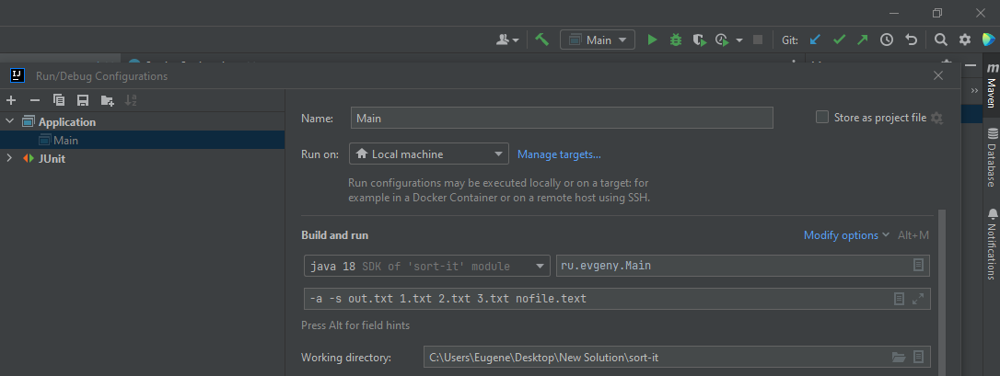

### JDK Version:

* 18

### Система сборки:

* Apache Maven 3.8.1

### Библиотеки:

* JUnit 4.13.2

JUnit Maven dependency:

        <dependency>
            <groupId>junit</groupId>
            <artifactId>junit</artifactId>
            <version>4.13.2</version>
            <scope>test</scope>
        </dependency>

### Запуск (1 способ):
* Открыть папку с проектом (В Intellij IDEA: открыть pom.xml как проект, подгрузить все необходимые зависимости через Reload Project в Maven)
* Выполнить цель ```mvn install```
* Исполняемый файл **sort-it-1.0.jar** будет находиться в папке **target**
* Запустить программу (пример для случая, когда запускаем из корневой директории проекта):

```java -jar target/sort-it-1.0.jar output.txt input1.txt input2.txt input3.txt```

### Запуск (2 способ, Intellij IDEA):
* Настроить конфигурацию, указав параметры запуска:



Рисунок 1 - Настройки конфигурации

* Запустить программу
